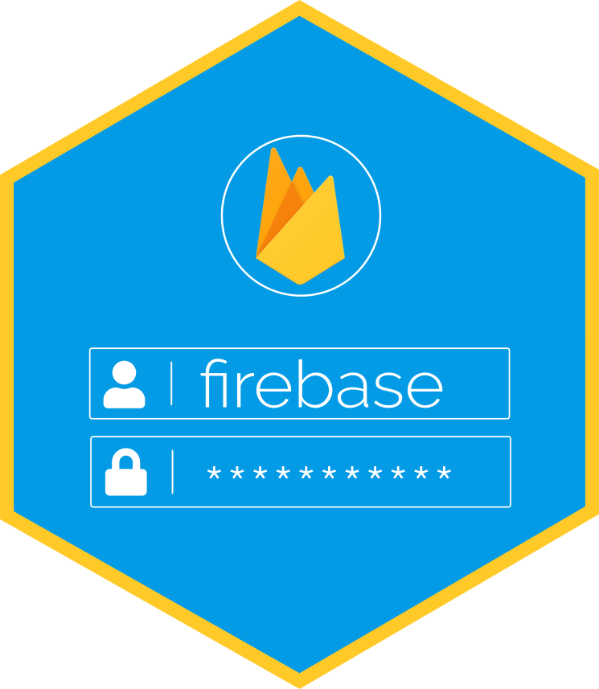

# Fireblaze 

<!-- badges: start -->
[](https://www.tidyverse.org/lifecycle/#experimental) [](https://travis-ci.org/JohnCoene/fireblaze) [](https://ci.appveyor.com/project/JohnCoene/fireblaze)  
<!-- badges: end -->

Authenticate Shiny users with [Google Firebase](https://firebase.google.com).

<a href="articles/get-started.html" class="btn btn-default"><i class="fa fa-rocket blue__color"></i> Get Started</a>
<a href="https://github.com/JohnCoene/firelbaze" class="btn btn-default"><i class="fa fa-github blue__color"></i> Github</a>

## Authentication Methods

Currently the following methods from Google Firebase are available in the package:

* Email & Password
* Email Link
* Google
* Github
* Facebook
* Twitter

## Install

Install from Github using remotes:

```r
# install.packages("remotes")
remotes::install_github("JohnCoene/fireblaze")
```
