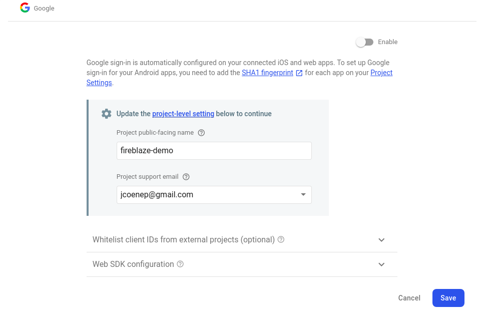

```{r, include = FALSE}
knitr::opts_chunk$set(
  collapse = TRUE,
  comment = "#>"
)
```

The {fireblaze} package lets you create mechanisms to authenticate Shiny user. It does so by wrapping the similar sounding [firebase](https://firebase.google.com/) interface by Google. This raises a first question, is it free? The answer to which is, this package only features the free functionalities which should, for now, probably fulfil most Shiny developers' needs. 

<div class="alert alert-dismissible alert-success">
<button type="button" class="close" data-dismiss="alert">&times;</button>
<h4>Skip ahead?</h4>
<p style="color:white;">In this first section we create a <a href="https://firebase.google.com" class="alert-link">Google Firebase</a> project, if you know how to do this or already have one, skip to the <a href="#configuration">package configuration section.</a>.</p>
</div>

## Firebase Project

First, create a Google firebase account if you do not already have one; head to [firebase.google.com](https://firebase.google.com/), and set up you account. Once this done you will be presented with the screen below.


First step, hit that large white button reading "Create a Project," and name your project.


Second step, either leave Google Analytics enabled to integrate your project with it or disable it. If confused, disable it, this can always be enabled later.


After that you should be done and eventually, after an intermediary screen, be presented with the project screen (below). Click the "web" icon (highlighted in red), Shiny applications are web hosted, we are thus technically setting up a web project. 


On the next screen name your project, here we just name it `fireblaze-demo`. Then hit "Register app".


On the next screen simply hit "Continue to console," you should not be concerned with any of the code presented, fireblaze takes care of it for you. This will lead you straight into the project you have just created. Now visit "Authentication" the left sidebar then click the most prominent button that reads "Set up sign-in method."


This screen lets you set-up which authentication methods you want to provide. Some only require a click, others need to be integrated with third-party services, all of which are very straightforward. However, we will begin by enabling two very simple authentication methods: email & password, and Google. This is will let users sign in by entering their email and password or using their Google account.

Click Email/password then the first enable button at the top. We will cover the second option later on. The first will require the user to enter their email and password, the second will users a sign-in link via email, thereby removing the need for a password. Then enable Google.



Fill the form as you wish, don't forget to toggle "enable" unlike I did above, and click save.

## Configuration

At this point you will need the R package, install it from Github if you haven't already done so.

```r
remotes::install_github("JohnCoene/fireblaze")
```

Navigate to your credentials page:

1. Click the gear icon <i class="fa fa-cog"></i> in the top left.
2. Click "project settings"
3. Scroll to the bottom of the "General" tab to find your app credentials.

In there you should find two key things `apiKey` and `projectId`. We will need these to create config file for {fireblaze}: the function below creates a `fireblaze.rds` file in your working directory. 

```r
fireblaze::create_config(api_key = "xXxxXxx", project_id = "my-project-package")
```

This file is necessary for every project that uses {fireblaze}; the package will look for it in the working directory by default.
